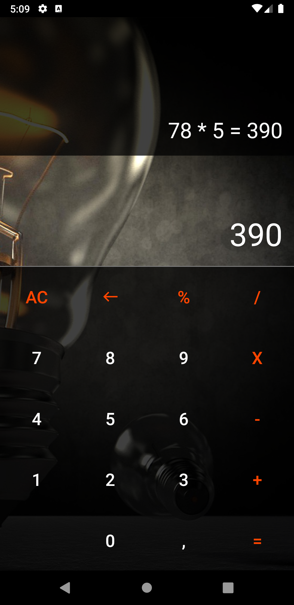
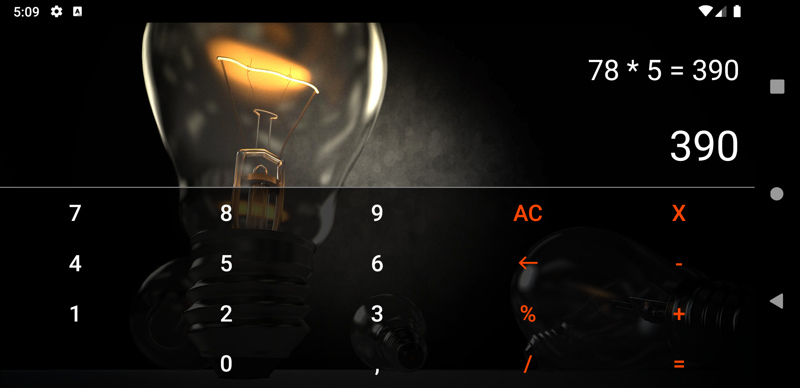
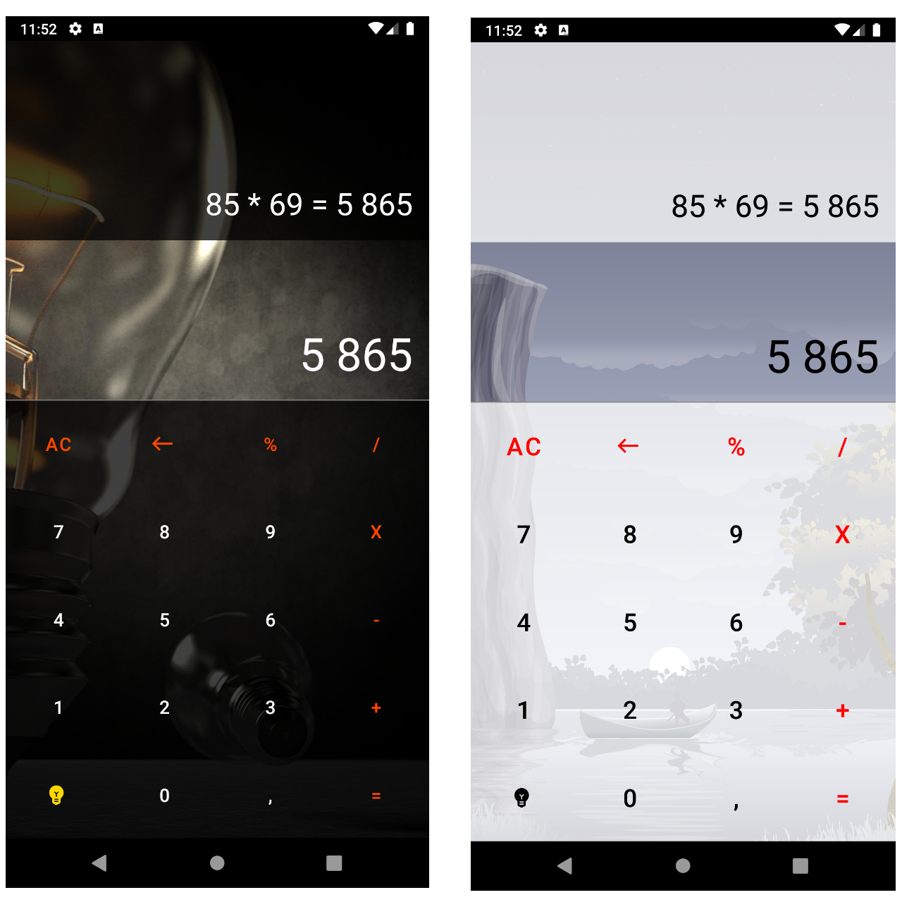
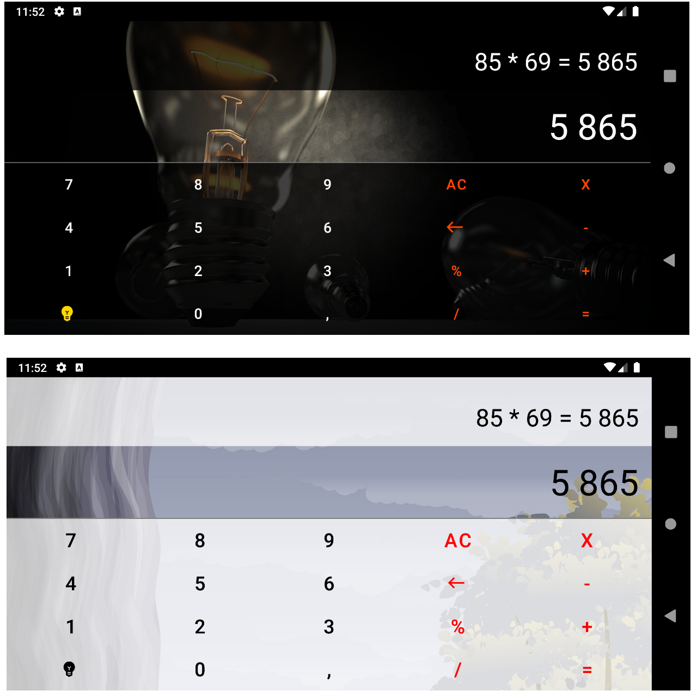

# Домашнее задание 2.
1. С этого урока будем писать приложение «Калькулятор». Выберите макет для работы с калькулятором. Обоснуйте, почему будете использовать именно этот тип макета.
2. Сверстайте главный экран калькулятора. На нём должны быть кнопки, обозначающие цифры и знаки действия: «Плюс», «Умножить», «Разделить», «Вычесть» и т. п.
3. \* Добавьте фоновый рисунок для экрана калькулятора. Следите, чтобы рисунок был для общего использования. Ресурсы: https://pxhere.com/, https://pixabay.com/ru/. 

\* Дополнительное задание

# Получившийся результат.

Использовал вот это фоновое изображение - https://pixabay.com/ru/illustrations/лампа-груша-освещение-света-3121677/ .

## Portrait mode

## Landscape mode

# Домашнее задание 3.
1. Напишите обработку каждой кнопки из макета калькулятора.
2. Создайте объект с данными и операциями калькулятора. Продумайте, каким образом будете хранить введённые пользователем данные.
3. \* Создайте макет калькулятора для горизонтальной ориентации экрана и отображайте его в ландшафтной ориентации.

\* Дополнительное задание

# Получившийся результат.

Что было сделано:
1. Немного изменил дизайн.
2. Создал отдельный макет для горизонтальной ориентации экрана. 
3. Реализовал полностью рабочий функционал калькулятора. 

## Portrait mode

## Landscape mode

## Demo

# Домашнее задание 4.

1. Переделайте все кнопки на Материал.
2. Все размеры и строки сделайте ресурсами.
3. Создайте стиль для своего приложения.
4. \* Создайте светлую и тёмную тему для приложения.

\* Дополнительное задание

# Получившийся результат.

Что было сделано:
1. Переделал все кнопки на MaterialButton.
2. Извлек оставшиеся размеры и строки в ресурсы.
3. Создал новые стили. Внёс изменения в уже существующую тему приложения.
4. Так как темная тема уже была, добавил светлую тему. 
5. Сделал возможность переключения между темами по кнопке "лампа".

## Portrait mode

## Landscape mode
