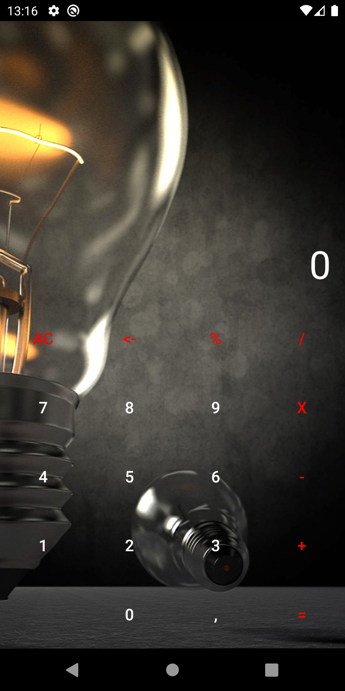
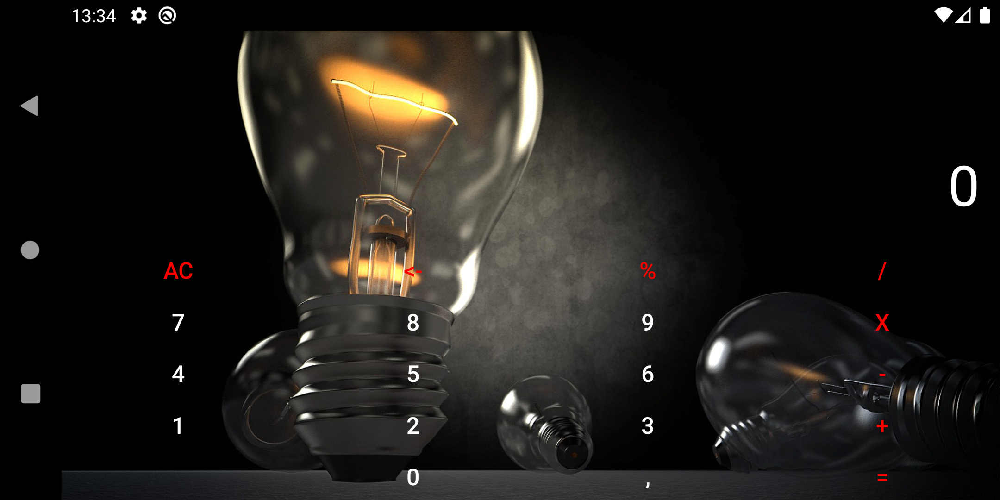

# Домашнее задание 2.
1. С этого урока будем писать приложение «Калькулятор». Выберите макет для работы с калькулятором. Обоснуйте, почему будете использовать именно этот тип макета.
2. Сверстайте главный экран калькулятора. На нём должны быть кнопки, обозначающие цифры и знаки действия: «Плюс», «Умножить», «Разделить», «Вычесть» и т. п.
3. \* Добавьте фоновый рисунок для экрана калькулятора. Следите, чтобы рисунок был для общего использования. Ресурсы: https://pxhere.com/, https://pixabay.com/ru/. 

\* Дополнительное задание

# Получившийся результат.

Использовал вот это фоновое изображение - https://pixabay.com/ru/illustrations/лампа-груша-освещение-света-3121677/ .

## Portrait mode

## Landscape mode

