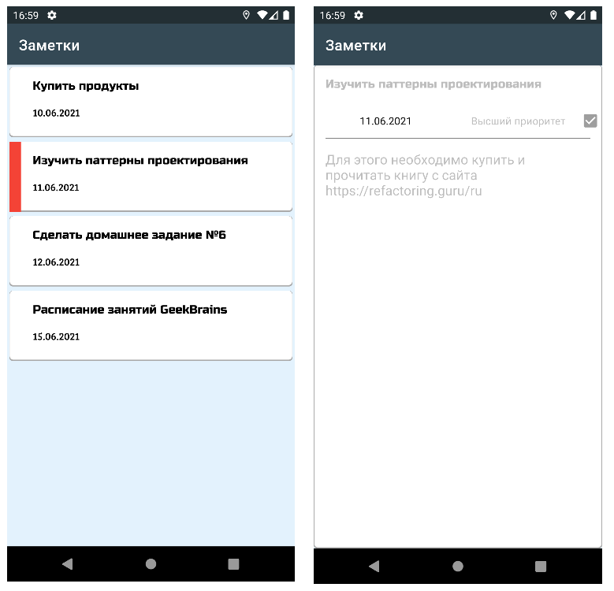
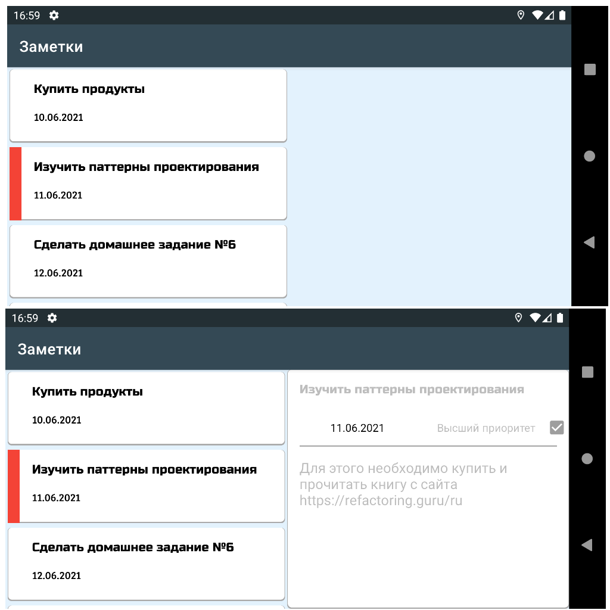
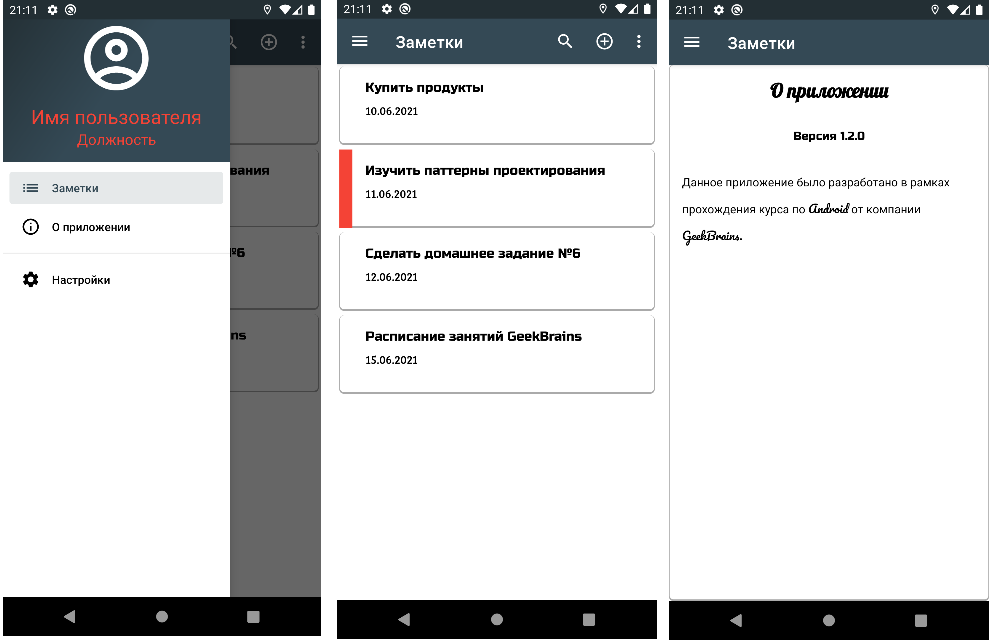
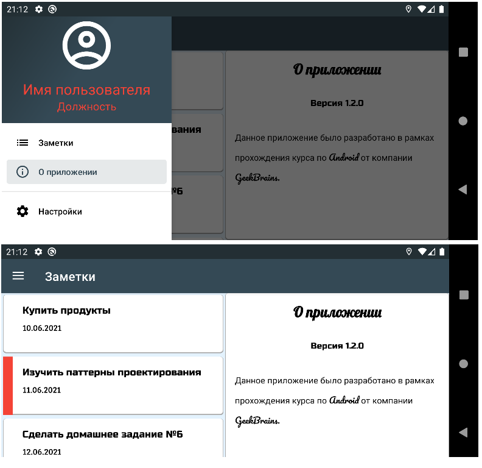
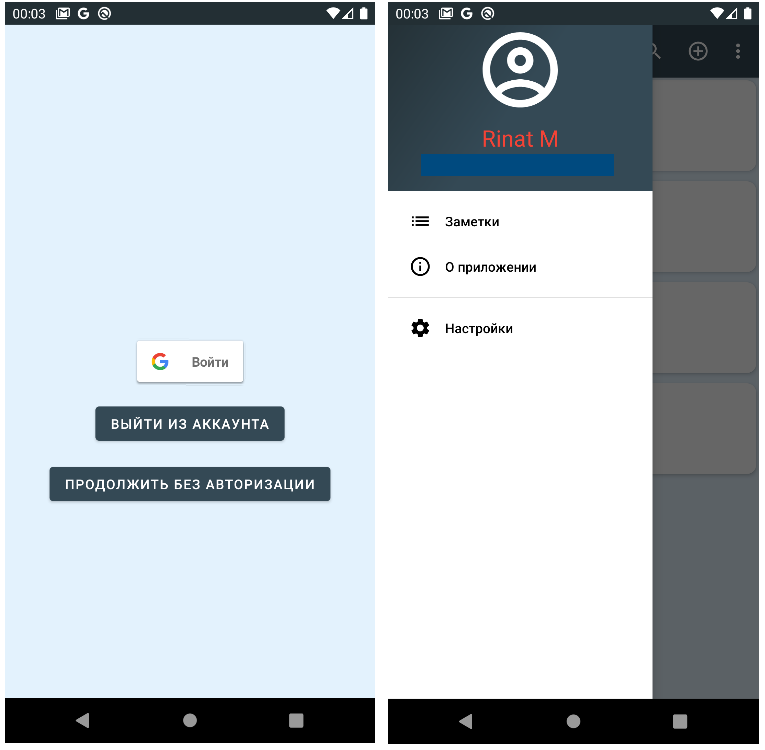

# Домашнее задание 6.
1. Создайте класс данных со структурой заметок: название заметки, описание заметки, дата создания и т. п.
2. Создайте фрагмент для вывода этих данных.
3. Встройте этот фрагмент в активити. У вас должен получиться экран с заметками, который мы будем улучшать с каждым новым уроком.
4. Добавьте фрагмент, в котором открывается заметка. По аналогии с примером из урока: если нажать на элемент списка в портретной ориентации — открывается новое окно, если нажать в ландшафтной — окно открывается рядом.
5. \* Разберитесь, как можно сделать, и сделайте корректировку даты создания при помощи DatePicker.

\* Дополнительное задание

# Получившийся результат.

Что было сделано:
1. Добавлен класс Note.
2. Сделал Single Activity Application. Одно активити MainActivity и 2 фрагмента: ListOfNotesFragment и NoteFragment.
3. Так как я реализовал Single Activity Application, то по факту у меня открывается не новое окно, а меняется фрагмент в существующем MainActivity.  
4. Реализовал макет и логику для ландшафта. Если заметка выбрана в портретном режиме, то после переворота выбранная заметка сохраняется.
5. Сделал корректировку даты создания через DatePickerDialog без сохранения состояния в самом списке. 

## Portrait mode

## Landscape mode

# Домашнее задание 7.
1. Подумайте о функционале вашего приложения заметок. Какие экраны там могут быть, помимо основного со списком заметок? Как можно использовать меню и всплывающее меню в вашем приложении? Не обязательно сразу пытаться реализовать весь этот функционал, достаточно создать макеты и структуру, а реализацию пока заменить на заглушки или всплывающие уведомления (Toast). Используйте подход Single Activity для отображения экранов.
2. Создайте боковое навигационное меню для своего приложения и добавьте туда хотя бы один экран, например «Настройки» или «О приложении».
3. \* Создайте полноценный заголовок для NavigationDrawer’а. К примеру, аватарка пользователя, его имя и какая-то дополнительная информация.

\* Дополнительное задание

# Получившийся результат.

Что было сделано:
1. Добавил функциональное меню у MainActivity, а также фрагменту NoteFragment. На все пункты меню сделал загрушки в виде Toast.
2. Создал боковое навигационное меню с пунктами: Заметки, О приложении, Настройки.
3. Создал полноценный заголовок для NavigationDrawer’а.
4. Реализовал новый экран "О приложении" и встроил его в текущую логику.

## Portrait mode

## Landscape mode

# Домашнее задание 8.
1. Создайте список ваших заметок.
2. Создайте карточку для элемента списка.
3. Класс данных, созданный на шестом уроке, используйте для заполнения карточки списка.
4. \* Создайте фрагмент для редактирования данных в конкретной карточке. Этот фрагмент пока можно вызвать через основное меню.

# Получившийся результат.

Что было сделано:
1. Добавил в проект RecyclerView для списка заметок.
2. У меня уже был отдельный xml для элемента списка, не много его изменил, добавив CardView.
3. Добавил NotesAdapter для RecyclerView. Для заполнения использую созданный ранее класс Note.
4. В ранее созданном фрагменте fragment_note.xml у меня была отключена возможность редактирования у EditText-ов и CheckBox-а. Включил возможность редактирования. При этом само сохранение измененной заметки ещё не реализовано.

# Домашнее задание 9.
1. Сделайте фрагмент добавления и редактирования данных, если вы ещё не сделали его.
2. Сделайте навигацию между фрагментами, также организуйте обмен данными между фрагментами.
3. \* Создайте контекстное меню для изменения и удаления заметок.
4. \* Изучите, каким образом можно вызывать DatePicker в виде диалогового окна. Создайте текстовое поле, при нажатии на которое вызывалось бы диалоговое окно с DatePicker.

# Получившийся результат.

Что было сделано:
1. Создал CustomApplication который наследуется от Application, для того чтобы создать класс CompositionRoot на этапе инициализации приложения. CompositionRoot использую в роли грубого Dependency Injection. 
2. Создал BaseFragment для инициализации CompositionRoot, все остальные фрагменты сделал наследниками BaseFragment.
3. Полностью переработал навигацию в приложении, вынес навигацию в отдельный класс ScreenNavigator. 
4. Реализовал сохранение состояния приложения при перевороте экрана в рамках нового класса ScreenNavigator.
5. Создал контекстное меню в списке заметок по долгому нажатию, там только один пункт - Удалить. Для изменения заметки необходимо одинарным нажатием выбрать заметку.
6. Реализовал сохранение изменений заметок.
7. Вызов DatePicker-а через диалоговое окно я делал ранее.  

# Домашнее задание 10.
1. Обеспечьте хранение данных приложения через Firestore.
2. \* Организуйте аутентификацию пользователя через Google.
3. \* Обеспечьте вход через социальную сеть ВКонтакте или любую аналогичную.

# Получившийся результат.

Что было сделано:
1. Добавил Cloud Firestore в проект. 
2. Создал Firestore database.
3. Изменил интерфейс NotesSource, добавил новый метод fetchData.
4. Были созданы NoteMapping и NotesFirabaseImpl. 
5. Внесены небольшие изменения в проект для использования NotesFirebaseImpl.
6. Создан новый экран AuthorizationActivity с 3 кнопками: Вход, Выход из аккаунта, Продолжить без авторизации. Сделал его стартовым.
7. Настроил через Google Cloud Platform учетные данные. Добавил для своего приложения OAuth 2.0 Client ID для возможности входа через Google account.
8. Реализовал возможность аутентификации пользователя через Google, а также выход из аккаунта.
9. После аутентификации на главный экран будут переданы DisplayName и Email. Далее будет обновлен header у navigation drawer.
10. Вход через ВКонтакте я не стал делать, на мой взгляд на текущем этапе достаточно Google.

## Portrait mode
